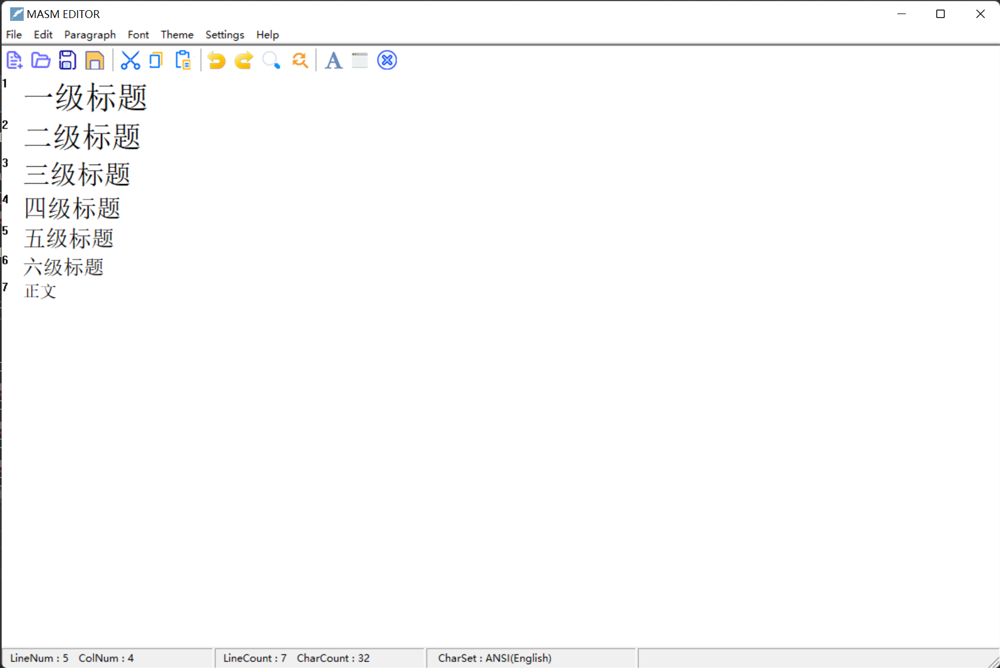
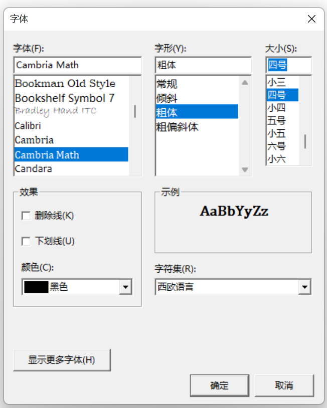
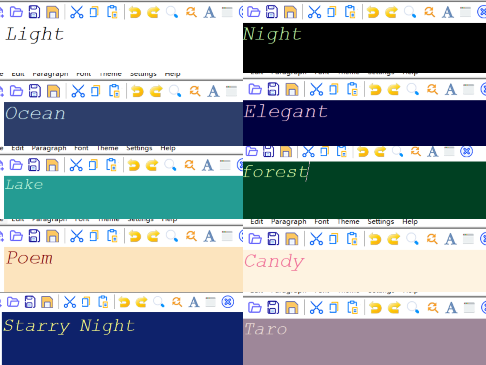
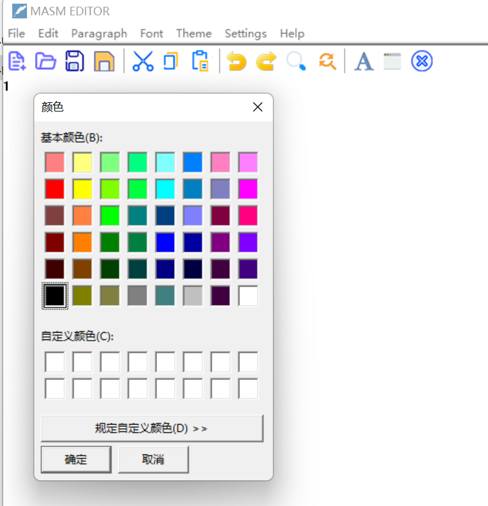
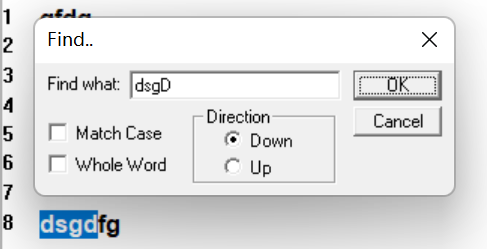
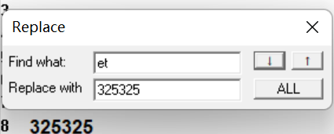
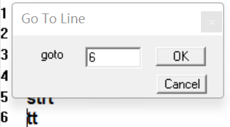
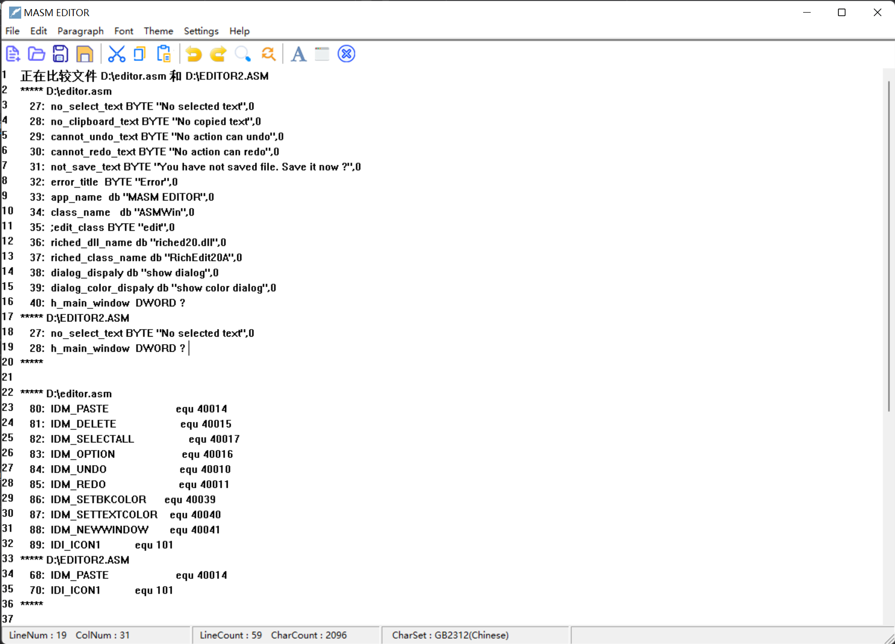
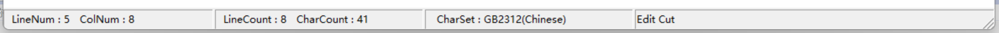
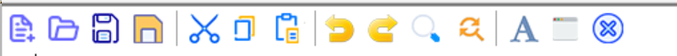

# Text editor based on masm32

Qi Ma ; Xinran Yu  ; Junyu Xu 

## Development environment

Assembler: MASM; IDE: VS2019; Operating System: Windows 11

## Compile and run method

Open the editor.sln file with Visual Studio 2019, configure the masm32 path in the project properties (you can refer to the masm32 environment configuration tutorial provided by the teaching assistant), and then run it with VS. There is an executable file `editor.exe` in the `bin` directory, which can be run directly on the Windows platform.

## Implementation Details

### Architecture section

We implemented a text editor program with a graphical interface based on MASM32. The main part uses the windows.inc/lib of the MASM32 library, creates an instance of the `WNDCLASSEX` window class, and presents the main window as the main page of the text editor. All editing operations are based on the Win32 `RichEdit` control. The version we are using is `riched20.dll` and the class we are using is `RichEdit20A`. The main flow of application execution (defined in `WinMain`) is as follows:

1. Declare the variable `MainWin` (an instance of the `WNDCLASSEX` window class)
2. Get the handle of the current process
3. Loader icon and cursor
4. Call `RegisterClassEx` to register the window class
5. Call `CreateWindowEx` to create the application main window.
6. Call `ShowWindow` to display the window
7. Loop processing messages

In addition to processing and defining the main process, it is also necessary to define the window process, which is defined in `WinProc`, and is processed according to the received Massage

+ WM_CREATE: window creation; WM_SIZE: change window size; WM_DESTROY: destroy window; WM_CLOSE: close window
+ WM_COMMAND: handle user commands
  + You need to further judge the command according to the lParam and wParam parameters, and perform operations such as saving files, opening files, and creating new files.

### File I/O operations

+ save reminder
  + When opening/creating/closing a file, it will check whether there are unsaved changes in the current window.

+ open file
  + By using the `OPENFILENAME` structure and calling `GetOpenFileName`, a dialog box will pop up for the user to select the file path. Then open the file with `CreateFile` and read the file with `ReadFile`.
+ save file
  + If it is a new file, go to "Save as file". If the file is already open, write to the file via `WriteFile`.
+ save as file
  + By using the `OPENFILENAME` structure and calling `GetSaveFileName`, a dialog box will pop up for the user to choose the save file path. The remaining operations are the same as saving the file.

+ new file
  + First check whether it needs to be saved, and then clear the window text.

### Editing operations

The corresponding editing operation is realized by sending the corresponding message to the `RichEdit` control. The message sent is as follows

+ Undo: first send EM_CANUNDO to check if the undo queue is empty, then send EM_UNDO
+ Redo: first send EM_CANREDO to check if the redo queue is empty, then send EM_REDO
+ Copy: first send `EM_EXGETSEL` to check if the selected area is empty, then send WM_COPY
+ Paste: first send `EM_CANPASTE` to check if the clipboard is empty, then send WM_PASTE
+ Cut: first send `EM_EXGETSEL` to check if the selected area is empty, then send WM_CUT
+ Delete: first send `EM_EXGETSEL` to check if the selected area is empty, then send EM_REPLACESEL
+ Select all: send EM_EXSETSEL

### Multi-level headings

Change the font size by sending an EM_SETFONTSIZE message to the `RichEdit` control to implement multi-level headings. The effect is as follows

### Set the font

By calling the `set_font_dialog` function to pop up a dialog box and let the user set the font, the option selected by the user can be changed by sending the `WM_SETFONT` message to change the global font. In order to preserve the text color before changing the font, we rewrite `FontDialog` and implement `MyFontDialog`. The settings dialog is as follows

### Setting Theme

By sending `EM_SETCHARFORMAT` and `EM_SETBKGNDCOLOR` to change the text color and background color with one click, to achieve a variety of theme colors

### Set background color and font color

+ set background color
  + By calling `ColorDialog`, a dialog box for selecting a color pops up, and after the user selects a color, send EM_SETBKGNDCOLOR to `RichEdit` to set the background color.
+ set font color
  + By calling `ColorDialog`, a dialog box for selecting a color pops up, and after the user selects a color, send EM_SETCHARFORMAT to `RichEdit` to set the **selected** area color.

### Advanced Operations

| Find                        | Replace                       | Line Jump               |
| --------------------------- | ----------------------------- | ----------------------- |
|  |  |  |

#### Find function

- Currently find feature support

  - Search forward or backward from the current position: Add `FR_DOWN` in the search option `uFlags` to search backward, if not set, it means search forward.

  - Set whether to be case-sensitive when searching: Add `FR_MATCHCASE` in `uFlags` to indicate that the search string is case-sensitive.

  - Set whether to match the whole word: add `FR_WHOLEWORD` in `uFlags`, which means match the whole word.

- Find the implementation of the function

  - In the resource file, define the dialog box and the value of the corresponding control to realize the setting of different search methods.
  - Send the `EM_FINDTEXTEX` message, returning the area where the text was found in the `chrgText` field. When a matching string is found, the string is set as the selection area. If you continue to search for the next one, you must use the end position of the selection area as the starting point for the next search, and set the end point as the maximum value (`cpMin=cpMax, cpMax=max`). And if it is looking up, just set the end point position to 0 (`cpMax=0`)

#### Replace function

- Currently replace function support

  - Replace one by one forward or backward: implemented similarly to find forward or backward.

  - One-click replacement of all found items: set the search range to the maximum, and use a while statement to replace all found text.

- Implementation of replacement function

  - After sending the `EM_FINDTEXTEX` message to implement the search function, the `chrgText` field of the `FINDTEXTEX` structure has returned the start and end positions of the found text. After setting it as the selection area, it can be replaced by sending the `EM_REPLACESEL` message operate.

#### line jump function goto

- Current line jump function support

  - Jump to the specified line

  - Jump to top or bottom of document (option in menu bar)

    Jump to line 0; send `EM_GETLINECOUNT` message to get the total line count, and jump to the last line.

- Realization of line jump function

  - Get the number of lines `LineNo` to be jumped from the dialog box, send `EM_GETLINECOUNT` message to get the total number of lines, when `LineNo` does not exceed the total number of lines, send `EM_LINEINDEX` message, get the index value of the line, and then The index value is sent to the `EM_SETSEL` message to set the currently selected text position, causing the cursor to jump to the beginning of the line.

#### Multi-window

Effect: New editing windows can be opened/closed, and different windows are independent of each other

Implementation principle: Get the program file name through `GetModuleFileName`, and then use `WinExec` to run an instance of the program to achieve multi-window.

#### Log-level file comparison function

Effect: You can compare the difference between the file in the current editing area and the specified file (specifically down to the line), which is convenient for users to check which lines they have modified. Click the `Compare File` option of `Edit` in the menu bar, and a dialog box will pop up for the user to select the file to be compared. After the selection is completed, the difference between the two files will be stored in the `diff.txt` file and displayed in the current window.

For example, the figure below is the difference between the `editor.asm` file and the previous version `editor2.asm` file

**Implementation principle**

A dialog box pops up to allow the user to select the file to be compared, and then obtain the path of the two files, use the `crt_system` to call the `fc` (file compare) program that comes with Windows to compare the files, and store the comparison result in the file `diff.txt `, displayed in the window.

### hot key

- Currently supported shortcut key functions are:

  `Ctrl-O`: open file, `Ctrl-S`: save file, `Ctrl-N`: open new file, `Ctrl-C`: copy, `Ctrl-V`: paste, `Ctrl-X` cut Cut, `Ctrl-F` to find.

- The implementation of this function is:

  In the loop processing message function, get the next piece of data from the message queue. If there is a message, call functions such as `GetKeyState` to determine whether the `Ctrl` key is pressed, and then determine whether the O/S key is pressed, etc. etc., call the corresponding open file/save file functions. Continue to add conditional judgments and call corresponding functions to realize more shortcut key functions.

### Status Bar

- The currently displayed content is:

  - Current line number: Send `EM_LINEFROMCHAR` information to `richedit`, the parameter is -1, get the current line number.

  - current column number

    Get the current line index (the position of the first character of the current line number) by sending `EM_LINEINDEX` to `richedit`. Then send `EM_EXGETSEL` to get the start position `cpMin` of the specified selection area, that is, the position of the cursor in the entire file, subtract the index of the current line, and get the position of the current cursor in this line, which is the column number.

  - The total number of lines in the file: send `EM_GETLINECOUNT` information to `richedit` to get the total line number.

  - The total number of characters in the file: send `EM_GETTEXTLENGTHEX` information to `richedit`, the parameter is the `GETTEXTLENGTHEX` structure, and get the total number of characters.

  - File **Character Set**

    By sending `EM_GETCHARFORMAT` information to `richedit`, the parameters are `SCF_DEFAULT` and `CHARFORMAT` structures, to obtain the global `bCharSet`, and make conditional judgments based on its values to obtain the corresponding encoding format (eg GB2312).

  - Toolbar icon information where the cursor stays

    When the window receives the `WM_NOTIFY` message, it means that the mouse is on the toolbar, and the information of the corresponding button can be obtained by judging the value of `wParam`.

- Creation of status bar, display of content

  - In the create window portion of the window procedure, call the create status bar function. state

  - The creation function of the bar is defined in the `Do_Status` function, which creates the status bar by calling the `CreateStatusWindow` function, and returns the status bar handle `hStatus`. Then send `SB_SETPARTS` to `hStatus` to divide the status bar into four segments, and the passed parameter `sbParts` specifies the size of each part in the form of an array.

    - By sending `SB_SETTEXT` information to `hStatus`, the parameters are the number of paragraphs to display the changed content, and the string address of the text, so that the status bar displays the corresponding text.

    ### toolbar

    

    - The buttons currently supported by the toolbar are: new file, open file, save, save as, cut, copy, paste, undo, redo, find, replace, set font, create new window, exit; when the mouse stays on the icon The button function will be prompted in the status bar

    - Implementation of toolbar

      - Design the bitmap of the toolbar part and import it into the resource file BITMAP of the project
      - Implemented macros `TBextraData`, `TBbutton`, `TBblank`, `Create_Tool_Bar`, which are called in the function `Do_ToolBar`. In the function `Do_ToolBar`, the bitmap is divided into 14 icons, and 14 `TBbutton` are created, and `button id` and `command id` are bound
      - In the window creation part of the window procedure, call `Do_ToolBar` to create the toolbar

      - In the set size section of the window procedure, resize the window, determine the toolbar position
      - In the command processing part of the window procedure, add the binding of the command id to its corresponding operation
      - In the notify part of the window procedure, add the binding of the command id and its corresponding operation text description, so as to realize the text prompt for the pointed icon in the status bar

    ### line number

    Effect: Display the line number on the left side of the editing area

    Implementation principle: [window subclassing technology](https://blog.csdn.net/qq_30145355/article/details/78756842) is used. Use `SetWindowLong` to set the new address of the message callback function of the child window, that is to say, intercept the message to the specified message callback function for processing.

    + Leave a blank space on the left side of the window for displaying line numbers
    + Whenever a WM_PAINT message is sent to `RichEditd`, first use our custom window to intercept the WM_PAINT message, draw the line number, and then send the message back to the default handler of `RichEdit` for processing.

    ### interface design

    Our interface design refers to a relatively mature text editor on the market: Typora, and strives to provide users with a better experience while improving its functions. Here we mainly introduce the menu bar part

    

    - After the `File` item is pulled down, there are the following 6 options: open file, create new file, save, save as, exit
    - After the `Edit` item is pulled down, there are 12 options: Undo, Redo, Cut, Copy, Paste, Delete, Select, Find, Replace, Goto, New Window, and File Comparison. After clicking Options, you can select all text, jump to the top of the page or jump to the end of the page
    - After the `Paragraph` item is pulled down, the selected paragraph can be set as a first-level title, a second-level title, and other different levels of titles, so that users can grasp the overall structure of the text.
    - After the `Font` item is pulled down, you can set the global font, font size, font style and text color through the dialog box
    - You can select the theme of the text editor after the `Theme` item is pulled down. Currently, ten different theme colors are designed for users to choose
    - After the `Settings` item is pulled down, you can choose to set the background color or text color. After clicking the option, a setting dialog box will pop up, select and click OK to set
    - After the `Help` item is pulled down, you can view the quick start tutorial of the text editor to assist users in learning operations.

## Difficulty

+ Designation of the file path to open/save the file
+ The main difficulty we have encountered is how to provide users with a friendly and convenient interactive window for specifying the path and file name of the open/save file. If the method of letting the user input a character string to specify the path is used, there will be problems such as relative path and absolute path are not clear, and the path does not exist.
+ To this end, we investigated the interface provided by Win32, and found the type structure of `OPENFILENAME`, and the two Win32 interfaces `GetOpenFileName` and `GetSaveFileName`, so that we can use the file manager provided by Windows to conveniently specify the file path and The file name avoids problems such as the path does not exist.
+ For this solution, we refer to a tutorial on opening/saving files: http://www.interq.or.jp/chubu/r6/masm32/tute/tute012.html
+ Realization of shortcut key functions:
  
  - At the beginning, we fell into the misunderstanding of using menu accelerator keys to realize shortcut keys, that is, adding accelerator keys in the resource file that defines the menu, and calling functions on the menu through shortcut keys. Later, it was found that this method can only be used when the menu bar is opened, which cannot meet the needs of users. Therefore, we will add it later by judging whether the keyboard input is a shortcut key in the loop processing message function.
    
  - For this solution we refer to a simple text editor project: https://github.com/philiparvidsson/Worlds-Smallest-Text-Editor
+ Implementation of font setting and color setting:
+ We used `FontDialog` and `ColorDialog` packaged by masm32 at the beginning, but it did not handle the user clicking "Cancel" or "OK" without clicking anything. The former is because it cannot tell the caller whether the user clicked or not. "Cancel", the latter because it doesn't set reasonable defaults (like it sets the background default to black). So we rewritten `FontDialog` and `ColorDialog`, implemented `MyFontDialog` and `MyColorDialog`, and called `ChooseFont` and `ChooseColor` of win32 internally.
+ show line number
+ Need to use window subclass technology, use our child window to intercept `WM_PAINT` message to draw line number, and then send it to `RichEdit` control to continue processing other messages.

## Innovation
- Inspired by the syntax of Markdown, we designed multi-level headings for text editors. The font size of the title is designed relative to the global font, which can meet the needs of users to grasp the text structure
- We have implemented a toolbar, which matches icon buttons for common operations, making it more convenient for users to operate
- Inspired by commonly used code editors, we designed different theme colors for text editors to enrich users' visual experience
- We have implemented a log-like file comparison function, which can easily allow users to compare the differences between two files (specific to the line), so that users can compare the differences between different versions of code files

## Group division
| Team Members | Before Midterm                | After Midterm                                                |
| ------------ | ----------------------------- | ------------------------------------------------------------ |
| Qi Ma        | System architecture, file I/O | Character editing operations (undo and redo, copy and paste, etc.), multi-level titles, setting background/font colors, multiple windows, log-like file comparison, display line numbers |
| Xinran Yu    | Interface Design, System Demo | Setting Fonts, Setting Themes, Toolbars, Interface Design    |
| Junyu Xu     | Shortcut key binding          | Find, replace, line jump goto, status bar, shortcut key binding |

## Video

    We recorded a short demonstration video (1 minute 30 seconds), in the video directory

## Author

+ Qi Ma(mq19 AT mails DOT tsinghua DOT edu DOT cn)
+ Xinran Yu
+ Junyu Xu 